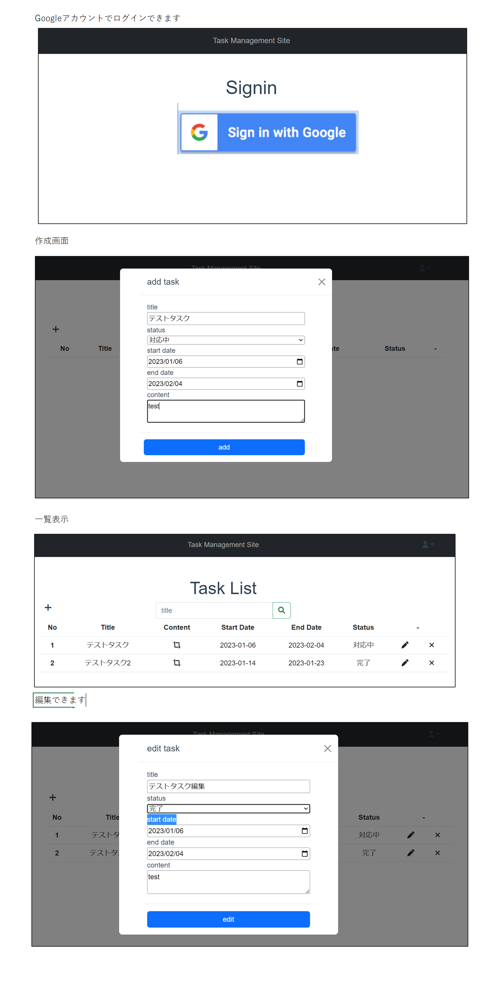

# Task Management Site
プログラミング練習用の簡単なタスク管理webシステム   
テスト作成中

## 使用技術
- Firebase Authentication
- Vue(Client) 
- Express(Backend)
- Mysql(DB)

## 開発環境 
docker,docker-composeを事前に導入しておいてください    

### 事前準備
1. firebaseプロジェクトを作成し、WEBアプリを設定する
2. Docker imageビルド 
```bash
$ docker compose build
```
3. appフォルダ apiフォルダのREADMEを参考にしてください

### サーバー起動
事前準備完了後、以下のコマンドでサーバー起動
```bash
# プロジェクトルートディレクトリで実行してください
# localhost:8080
$ docker compose up -d
# DBに事前に必要なデータを登録する(最初だけ実行してくただい)
$ docker compose run --rm api npx typeorm-ts-node-commonjs migration:run -d ./data-source.ts
```

### システム内容
